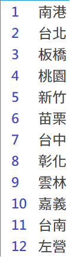

# 高鐵訂票小幫手
## forked from [BreezeWhite/THSR-Ticket](https://github.com/BreezeWhite/THSR-Ticket)

**!!--純研究用途，請勿用於不當用途--!!**

本專案提供自動化訂購台灣高鐵車票的功能，支援 CLI (命令列) 互動模式與 Web 介面 (批次搶票) 模式。

## 功能特色

- **自動驗證碼辨識**: 內建 CNN 模型自動識別驗證碼，無需人工輸入。
- **CLI 互動模式**: 經典的終端機互動介面，適合單次快速操作。
- **Web 介面 (批次搶票)**: 
  - 提供圖形化介面管理訂票任務。
  - 支援同時建立多個搶票任務。
  - 自動重試機制：系統會持續嘗試直到訂票成功。

## 安裝與前置作業

### 1. 安裝 Python Packages

使用 pip:
```bash
pip install -r requirements.txt
```

若您使用 [uv](https://github.com/astral-sh/uv) (推薦):
```bash
uv sync
```

## 執行方法

### 方式一：Web 介面 (推薦)

啟動網頁伺服器：
```bash
python thsr_ticket/server.py
```
啟動後，請開啟瀏覽器訪問 `http://localhost:8000`。
您可以在網頁上設定訂票參數並送出任務，系統將在後台自動進行搶票，並可隨時查看任務進度。

### 方式二：CLI 互動模式

```bash
python thsr_ticket/main.py
```
程式將引導您輸入訂票資訊。

### 修改預設參數 (CLI 模式)

成功訂票後會建立紀錄 `/thsr_ticket/.db/history.json`，如果下次訂票想要快速開始可以進去修改參數。

```json
{
    "_default": {
        "1": {
            "adult_num": "1F",
            "dest_station": 12,
            "outbound_date": "2025-01-24",
            "outbound_delay_time": "21",
            "outbound_time": "700P",
            "personal_id": "E123456789",
            "phone": "0999999999",
            "start_station": 5
        }
    }
}
```

- **adult_num**: 預定票數，只支援成人票，只需修改數字並不要動F
- **dest_station**: 目標車站，參考下方車站代碼
- **outbound_date**: 出發日期 (YYYY-MM-DD)
- **outbound_delay_time**: 可接受最晚時間 (例如 21 表示不接受 21 點以後的車次)
- **outbound_time**: 出發時間 (P為下午，A為上午，例如 700P = 19:00, 930A = 09:30)
- **personal_id**: 身分證字號
- **phone**: 電話
- **start_station**: 起始車站，參考下方車站代碼

#### 車站代碼參考

